# Architecture

This page maps ExAtlas's modules and processes as they exist on main after
PR #102, read from `lib/`. It exists so a new reader finds the orchestrator's
parts and their start order without reading 3,000 lines. The library has no
database and no web UI. It runs inside the host application's VM.

## Context

| Actor | Talks to ExAtlas by |
|---|---|
| Host Phoenix app | Calls `ExAtlas` and `ExAtlas.Orchestrator`; subscribes to `ExAtlas.PubSub` topics `"compute:<id>"` |
| RunPod | HTTPS through `Req` (`ExAtlas.Providers.RunPod.Client`): pods, catalog, billing, templates, volumes, endpoints, jobs |
| Lambda Cloud API v1 | HTTPS through `Req` (`ExAtlas.Providers.LambdaLabs.Client`): instance types, firewall rulesets, launch, get, list, terminate |
| Vast.ai API | HTTPS through `Req` (`ExAtlas.Providers.Vast.Client`): offer search, rent, get, list (v1, paged by `next_token`), stop and start (`PUT` state), charges (paged by `next_token`), destroy |
| A Vast instance | A marketplace host runs the image as a Docker container with its own entrypoint; Vast maps each container port to a random host port |
| A Lambda instance | cloud-init runs the `user_data` script ExAtlas wrote; it starts the container with `docker run`. With a callback, a `systemd-run` unit POSTs the container's exit code to `Callback.Plug` |
| A running pod | POSTs to the host through `ExAtlas.Callback.Plug` (progress, logs, finish) |
| Fly.io | `ExAtlas.Fly.*`: deploys, log streams, tokens |
| A shared store | Optional host `TrackingStore` implementation (a database) |

## Modules

| Layer | Modules |
|---|---|
| Facade | `ExAtlas` (`dispatch/3`, `dispatch_optional/3`), `ExAtlas.Config` (its `seal_credentials/1` wraps credentials), `ExAtlas.Secret`, `ExAtlas.Error` |
| Contract | `ExAtlas.Provider` (behaviour, optional callbacks) |
| Providers | `Providers.HTTP` (shared `Req` plumbing and the 429-only spawn retry), `Providers.RunPod` (with `Pods`, `Jobs`, `Catalog`, `Billing`, `Templates`, `NetworkVolumes`, `Endpoints`, `Translate`, `Client`), `Providers.LambdaLabs` (with `Client`, `Translate`, `Firewall`), `Providers.Vast` (with `Client`, `Translate`), `Providers.Shell` (POSIX quoting for the providers' scripts, and the trap that reports a command's exit and deletes its RunPod pod or Vast instance), `Providers.Mock`, the stub `Providers.Fly` (built with `Providers.Stub`) |
| Specs | `ExAtlas.Spec.*`: `ComputeRequest` (its `container_env/1` is the env every provider sends), `Staging` (the `s3:` option), `Compute`, `Spend`, `Template`, `NetworkVolume`, `Endpoint`, `Job`, `GpuType` and the request structs |
| Callback | `ExAtlas.Callback`, `Callback.Plug`, `Callback.Token`, `Callback.Limiter` |
| Auth | `ExAtlas.Auth` (the env and handle for each `auth:` scheme, shared by providers), `ExAtlas.Auth.Token`, `ExAtlas.Auth.SignedUrl` |
| Orchestrator | listed below |
| Fly ops | `ExAtlas.Fly`, `Fly.Deploy`, `Fly.Logs.*`, `Fly.Tokens.*`, `Fly.TokenStorage` (DETS) |
| Dashboard | `ExAtlas.LiveDashboard.ComputePage` |
| Installer | `mix ex_atlas.install`, `mix ex_atlas.upgrade` (Igniter; the 0.8.0 step only warns, see `guides/upgrading.md`) |

## Orchestrator parts

| Module | Kind | Job |
|---|---|---|
| `Orchestrator` | Functions | Public API. `spawn/1` validates options, stamps the owner, rents the pod, checks the price, persists, starts a tracker |
| `Orchestrator.ComputeServer` | One `GenServer` per pod, `restart: :temporary` | Idle TTL, status poll, `max_runtime_ms`, `ready_timeout_ms`, `max_cost`, billing reconcile, respawn, teardown in `terminate/2` |
| `Orchestrator.CostMeter` | Pure | Spend estimate, cap timer delay, `reconcile/3`, `new_pod/2`, `resume/4` |
| `Orchestrator.TaskOutcome` | Pure | Decides whether an observation ends a `mode: :task` session, and how |
| `Orchestrator.UpstreamStatus` | Pure | Classifies a provider answer: `{:alive, _}`, `{:dead, reason, _}`, `{:poll_failed, _}` |
| `Orchestrator.Timer` | Constants | `max_ms/0` (4,294,967,295) and `option_type/0` for every timer option |
| `Orchestrator.Events` | Functions | PubSub broadcasts `{:atlas_compute, id, event}` |
| `Orchestrator.TrackingStore` | Behaviour | `put/1`, `get/1`, `delete/1`, `all/0`, `child_spec/1`. Default `TrackingStore.Dets` |
| `Orchestrator.TrackingStore.Ecto` | Functions, no process | Records as `term_to_binary` blobs in the host repo's `atlas_tracking_records`, decoded with `[:safe]`. `Ecto.Migration` creates the table |
| `Orchestrator.Supervisor` | `Supervisor` | The orchestrator's tree for a host to start after its repo; `children/0` is the one child list |
| `Orchestrator.Adopter` | Transient `Task` | At boot, re-creates trackers from the store, then releases the Reaper |
| `Orchestrator.RespawnCredentials` | Behaviour | Marks a host module whose function a record's `respawn_credentials:` may call |
| `Orchestrator.Reaper` | `GenServer` | Every `reap_interval_ms`, deletes untracked pods that carry the prefix and this node's owner |
| `Orchestrator.Ownership` | Functions | Reads and validates `reap_owner`; stamps it into pod names |
| `Orchestrator.ComputeRegistry`, `ComputeSupervisor` | `Registry`, `DynamicSupervisor` | Look up and supervise trackers |
| `Callback` | Functions | Routes a pod's report into a tracker through the `Registry` |

Start order (`ExAtlas.Orchestrator.Supervisor.children/0`): the tracking
store, `ComputeRegistry`, the `Task.Supervisor` for polls, `ComputeSupervisor`,
`Callback.Limiter`, `Phoenix.PubSub` (when loaded), `Reaper`, `Adopter`.
`start_orchestrator: true` starts that list in ExAtlas's own application;
`ExAtlas.Orchestrator.Supervisor` starts it in the host's tree instead.

## The orchestrator started after the host's repo

A store in the host's database (`TrackingStore.Ecto`, #120) is readable only
once the host's repo runs, and ExAtlas's application boots before the host's.
So the host sets `start_orchestrator: false` and starts
`ExAtlas.Orchestrator.Supervisor` after its repo:

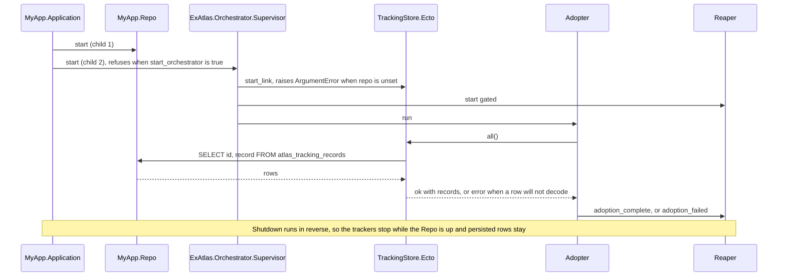

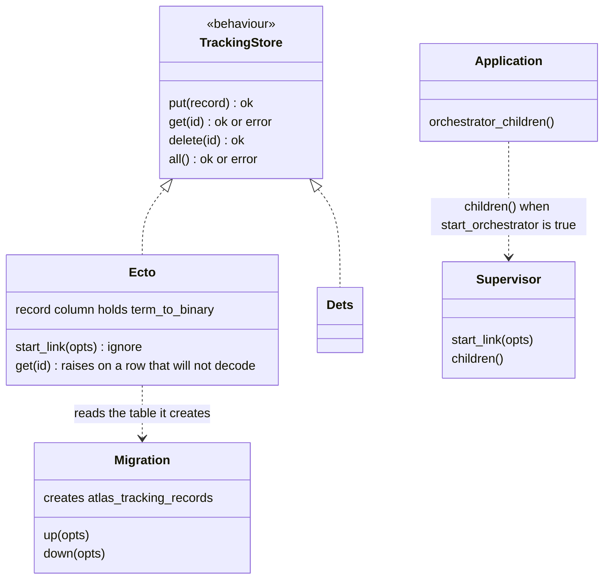

When the store cannot answer, nothing is reaped: `all/0` returns an error and
the Adopter sends `adoption_failed`; `get/1` raises and the Reaper treats the
pod as ours; a tracker logs the raise and keeps its pod.

## The orchestrator at runtime

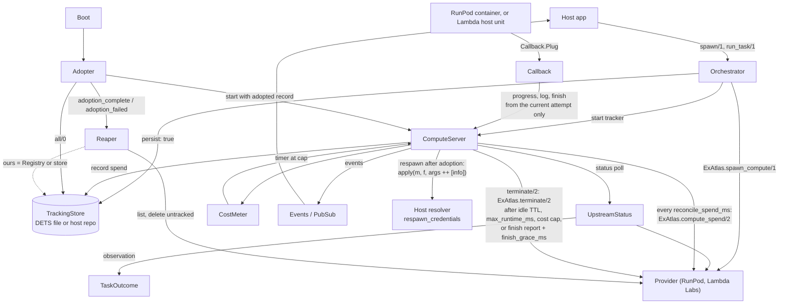

## What a respawn after adoption does

A tracking record holds `:not_stored` in place of `s3:` credentials and
`env:` values. When an adopted `on_failure: {:respawn, n}` task is
preempted, `ComputeServer.spawn_replacement/1` asks the host's
`respawn_credentials:` resolver for them (#87). The record's tuple comes
first, then `config :ex_atlas, :orchestrator, respawn_credentials:`. A task
that never restarted holds its own values and calls no resolver.

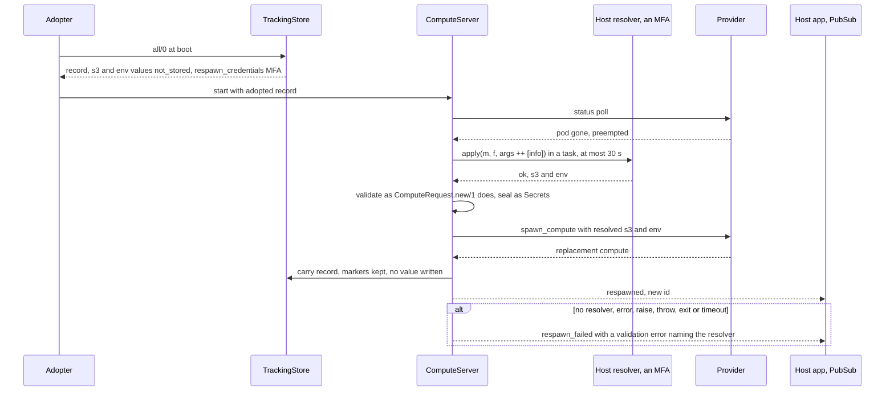

The resolved values live in the tracker's opts, so a second respawn in the
same VM reuses them. The next restart calls the resolver again.

## A late report from a replaced pod

Every pod of a task shares its `task_id`; its token also signs its attempt
(#100). `ComputeServer` keeps the current attempt as the Registry value of
`{:callback, task_id}` and moves it before it rents a replacement. A report
already queued in the tracker carries its attempt, and the tracker drops it
when the attempt is stale. `Callback.take/2` spends a bucket keyed by task and
attempt before `ingest/3` runs, so the replaced pod's refused reports never
spend the replacement's budget (#107).

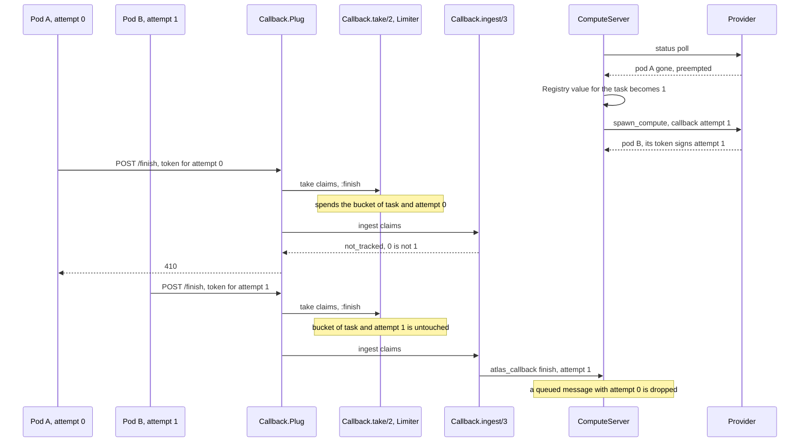

A token minted by 0.8.0 has no attempt (#110). `ComputeServer` registers
`:claimless` instead of the attempt while its current pod holds such a token (a
task adopted from a 0.8.0 record, not respawned since), and `ingest/3` accepts
a claim-less token only against that value. The first respawn this version makes
registers the attempt, so the replaced pod's claim-less token gets 410. The
respawn also writes the attempt into the stored record's callback descriptor,
so a restart adopts the task as claim-bearing. The
tracker repeats the test for a claim-less report already in its mailbox. A task
that 0.8.0 itself respawned keeps two claim-less pods, which risk 49 records.

A node can die after the provider rents the replacement and before
`carry_record/3` moves the record to it (#114, risk 51). So the respawn first
writes `respawning: n` into the old record. The next boot's tracker counts
attempt `n` as spent and registers `:none`, which matches no token, until its
own respawn registers `n + 1`. It logs a warning naming the pod name; the
Reaper deletes the orphan, which no record names, when its provider is in
`:reap_providers`. `spawn/1` warns when a respawning task's provider is not
(#118); `:vast` is not by default.

The tracker checks a report against the attempt in its opts' callback
descriptor, which every respawn writes, while `respawns` counts the budget.
The two differ only in an interrupted adoption. If the first poll reads the
record's pod alive again (an outbid spot pod that won back its bid), the
tracker leaves `:none` and registers that pod's own attempt (#118). With
`status_poll_ms: false` no poll runs, and the pod's reports get 410 until the
deadline.

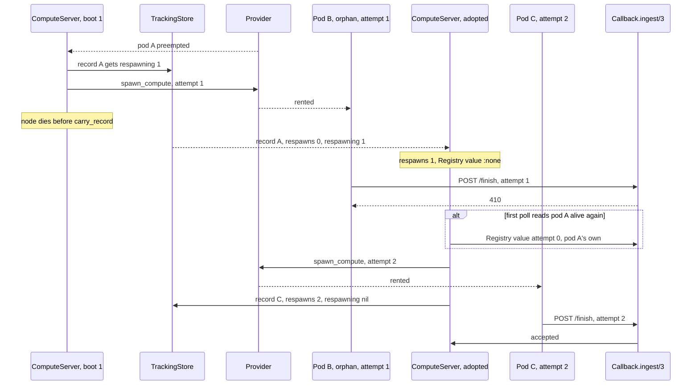

## What a cost cap does

1. `spawn/1` refuses a provider that reports no price: it deletes the pod and
   returns `:unsupported`.
2. `CostMeter` multiplies `cost_per_hour` by elapsed time; `ComputeServer`
   arms one timer for the moment spend reaches `max_cost`.
3. A status poll with a new price re-arms the timer.
4. Every `reconcile_spend_ms`, `ComputeServer` runs `ExAtlas.compute_spend/2`
   on the current pod in a task. A bill above the estimate raises spend and
   re-arms the timer. It broadcasts `{:spend_reconciled, map}` with
   `estimated_usd`, `billed_usd` and `spent_usd`.
5. A respawn calls `CostMeter.new_pod/2`; a bill queued for the replaced pod
   is ignored.

On Vast (#116) step 4 reads `GET /api/v0/charges/` for the UTC days from the
pod's start. Vast takes no instance filter, so `Providers.Vast` pages through
the account's contract rows and keeps those whose `source` is
`instance-<id>`. The total is their `amount`; `gpu_usd` and `disk_usd` sum
the `gpu` and `disk` items.

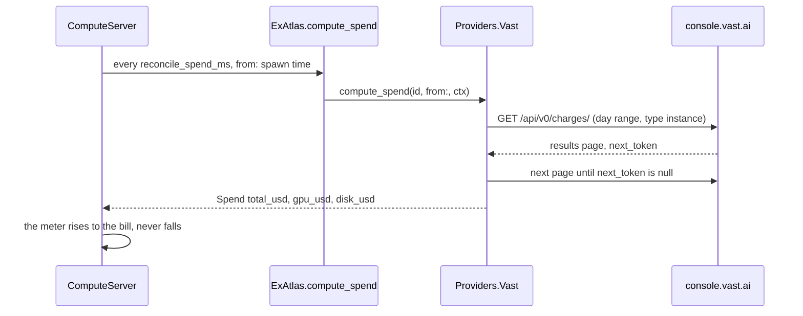

## A Lambda Labs spawn

Lambda rents VMs. `Providers.LambdaLabs` reads the catalog for price and
capacity, then launches with a cloud-init script that runs the container.
The tags let any node rebuild the `Compute` with no local state. Added in
#89. A spawn with `ports:` also creates a firewall ruleset for the instance
(#86); `us-south-1` and a spawn with no ports skip it.

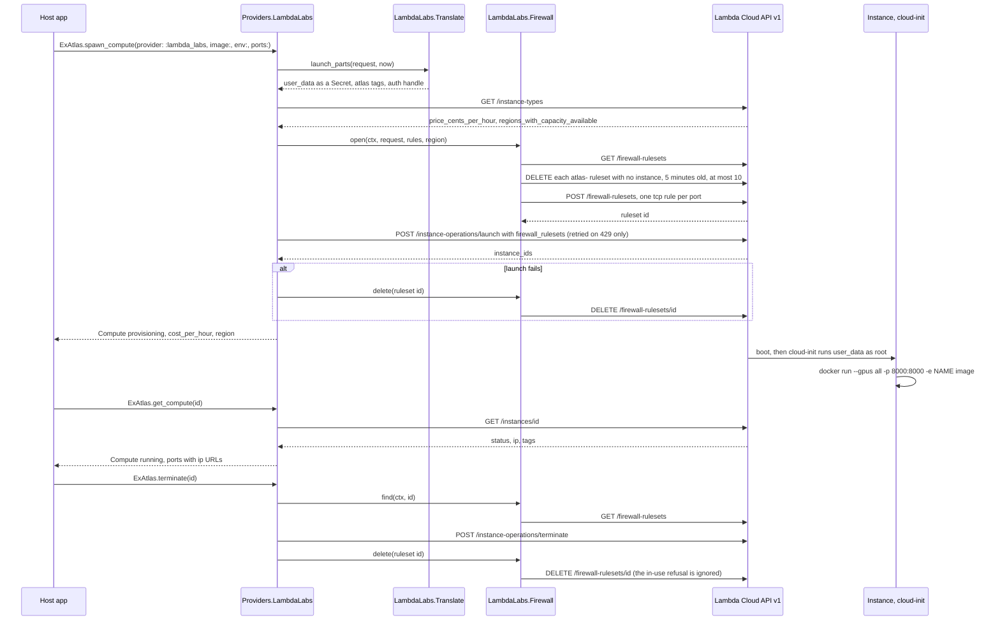

## A Vast.ai spawn

Vast is a marketplace. `Providers.Vast` searches the on-demand offers and
rents the cheapest in the first hinted country, trying the next of three
only when Vast refused the rent. Added in #99. With `command:` the container
deletes its own instance when the command ends (#105). With `spot: true` the
search is `type: "bid"` and the rent carries `price`, the offer's `min_bid`
(#112); see "A Vast.ai spot respawn" below.

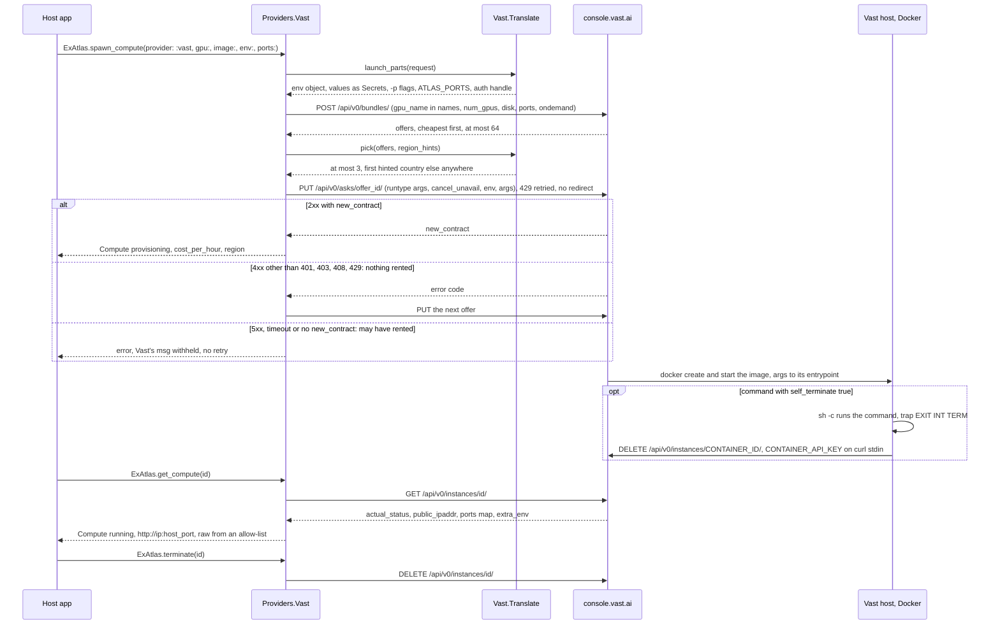

## A Vast.ai spot respawn

`spot: true` changes the search and the rent, and nothing in the orchestrator
(#112). An outbid instance reads `exited`; `UpstreamStatus.classify/2` maps
`:stopped` to `:preempted` for a spot task, and `ComputeServer.respawn/2`
rents a replacement before `release_old/1` destroys the old instance. A
`callback:`'s finish report keeps a task that finished from reading as outbid.

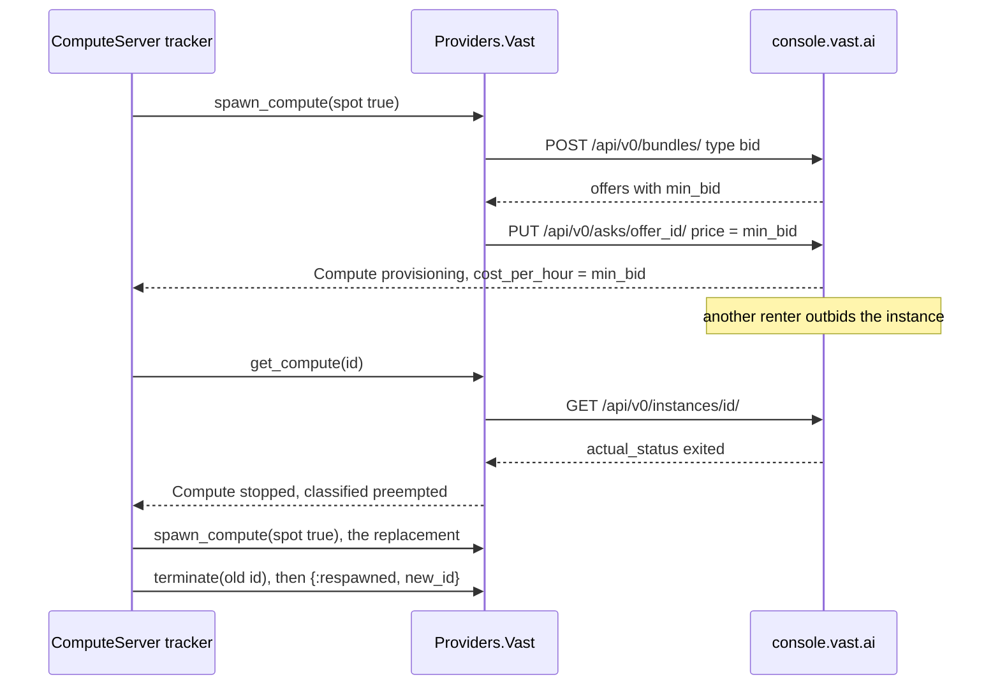

## A Lambda task, ended by the host's report

A Lambda instance holds no key that can delete it. With `command:` and a
callback, the host script starts the container, then a transient
`systemd-run` unit that waits on it and POSTs its exit code. The tracker
finishes on the report and terminates the instance. Without a callback,
`self_terminate: true` is `:validation` before any request. Added in #85.

An interactive `Orchestrator.spawn/1` session with the same `command:` and
callback ends the same way, since #96: `finish_grace_ms` after the report it
broadcasts `{:terminating, :finished}` instead of a task outcome, and
`touch/1` does not postpone it. With `self_terminate: false` the report is
announced and the session runs on.

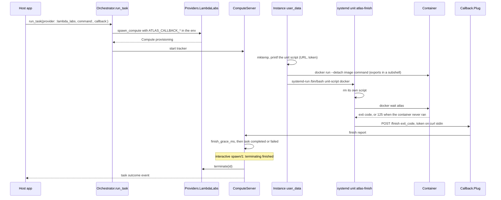

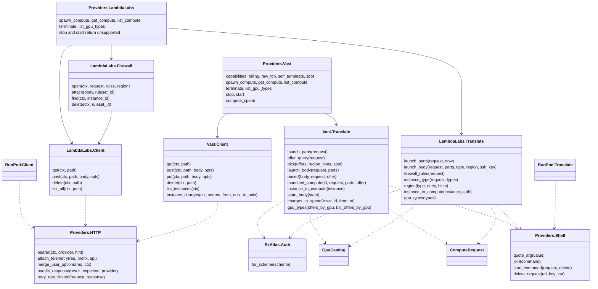
