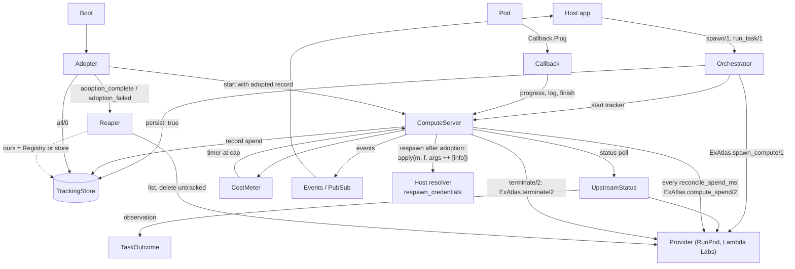
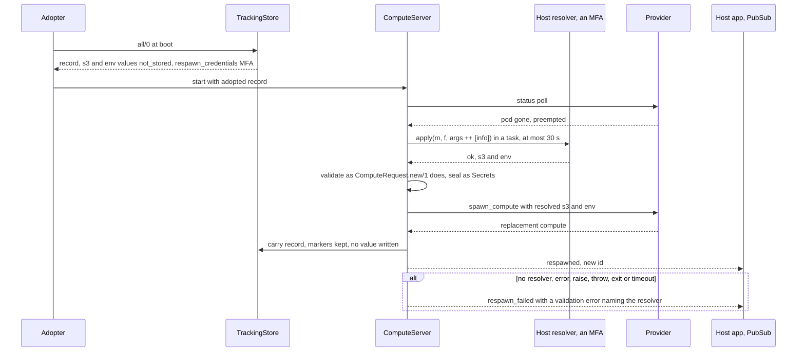
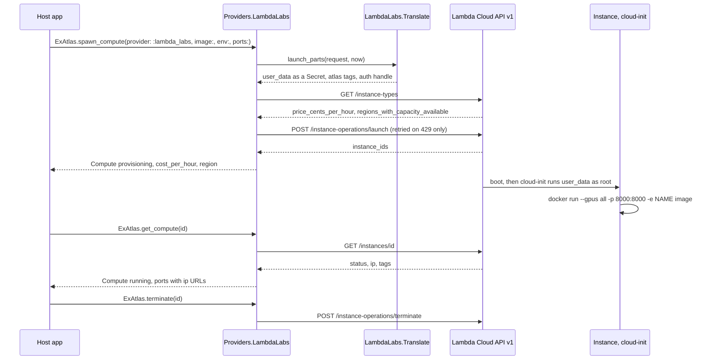
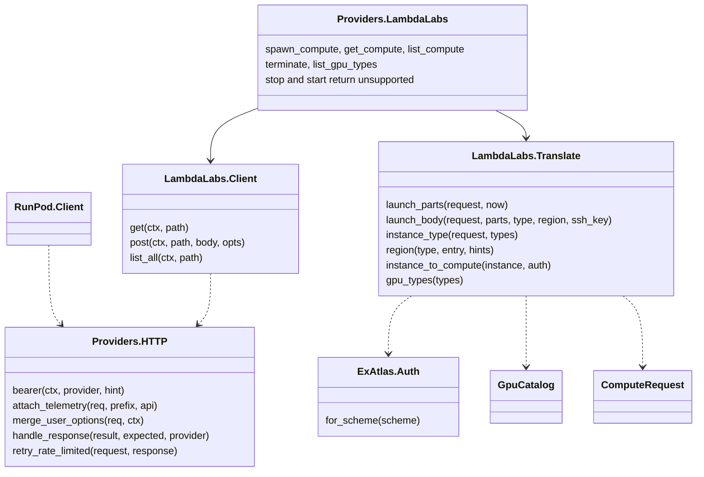

# Architecture

This page maps ExAtlas's modules and processes as they exist on the branch of
PR #70, read from `lib/`. It exists so a new reader finds the orchestrator's
parts and their start order without reading 3,000 lines. The library has no
database and no web UI. It runs inside the host application's VM.

## Context

| Actor | Talks to ExAtlas by |
|---|---|
| Host Phoenix app | Calls `ExAtlas` and `ExAtlas.Orchestrator`; subscribes to `ExAtlas.PubSub` topics `"compute:<id>"` |
| RunPod | HTTPS through `Req` (`ExAtlas.Providers.RunPod.Client`): pods, catalog, billing, templates, volumes, endpoints, jobs |
| Lambda Cloud API v1 | HTTPS through `Req` (`ExAtlas.Providers.LambdaLabs.Client`): instance types, launch, get, list, terminate |
| A Lambda instance | cloud-init runs the `user_data` script ExAtlas wrote; it starts the container with `docker run` |
| A running pod | POSTs to the host through `ExAtlas.Callback.Plug` (progress, logs, finish) |
| Fly.io | `ExAtlas.Fly.*`: deploys, log streams, tokens |
| A shared store | Optional host `TrackingStore` implementation (a database) |

## Modules

| Layer | Modules |
|---|---|
| Facade | `ExAtlas` (`dispatch/3`, `dispatch_optional/3`), `ExAtlas.Config` (its `seal_credentials/1` wraps credentials), `ExAtlas.Secret`, `ExAtlas.Error` |
| Contract | `ExAtlas.Provider` (behaviour, optional callbacks) |
| Providers | `Providers.HTTP` (shared `Req` plumbing and the 429-only spawn retry), `Providers.RunPod` (with `Pods`, `Jobs`, `Catalog`, `Billing`, `Templates`, `NetworkVolumes`, `Endpoints`, `Translate`, `Client`), `Providers.LambdaLabs` (with `Client`, `Translate`), `Providers.Mock`, stubs `Providers.Fly`, `Providers.Vast` (built with `Providers.Stub`) |
| Specs | `ExAtlas.Spec.*`: `ComputeRequest` (its `container_env/1` is the env every provider sends), `Staging` (the `s3:` option), `Compute`, `Spend`, `Template`, `NetworkVolume`, `Endpoint`, `Job`, `GpuType` and the request structs |
| Callback | `ExAtlas.Callback`, `Callback.Plug`, `Callback.Token`, `Callback.Limiter` |
| Auth | `ExAtlas.Auth` (the env and handle for each `auth:` scheme, shared by providers), `ExAtlas.Auth.Token`, `ExAtlas.Auth.SignedUrl` |
| Orchestrator | listed below |
| Fly ops | `ExAtlas.Fly`, `Fly.Deploy`, `Fly.Logs.*`, `Fly.Tokens.*`, `Fly.TokenStorage` (DETS) |
| Dashboard | `ExAtlas.LiveDashboard.ComputePage` |
| Installer | `mix ex_atlas.install`, `mix ex_atlas.upgrade` (Igniter) |

## Orchestrator parts

| Module | Kind | Job |
|---|---|---|
| `Orchestrator` | Functions | Public API. `spawn/1` validates options, stamps the owner, rents the pod, checks the price, persists, starts a tracker |
| `Orchestrator.ComputeServer` | One `GenServer` per pod, `restart: :temporary` | Idle TTL, status poll, `max_runtime_ms`, `ready_timeout_ms`, `max_cost`, billing reconcile, respawn, teardown in `terminate/2` |
| `Orchestrator.CostMeter` | Pure | Spend estimate, cap timer delay, `reconcile/3`, `new_pod/2`, `resume/4` |
| `Orchestrator.TaskOutcome` | Pure | Decides whether an observation ends a `mode: :task` session, and how |
| `Orchestrator.UpstreamStatus` | Pure | Classifies a provider answer: `{:alive, _}`, `{:dead, reason, _}`, `{:poll_failed, _}` |
| `Orchestrator.Timer` | Constants | `max_ms/0` (4,294,967,295) and `option_type/0` for every timer option |
| `Orchestrator.Events` | Functions | PubSub broadcasts `{:atlas_compute, id, event}` |
| `Orchestrator.TrackingStore` | Behaviour | `put/1`, `get/1`, `delete/1`, `all/0`, `child_spec/1`. Default `TrackingStore.Dets` |
| `Orchestrator.Adopter` | Transient `Task` | At boot, re-creates trackers from the store, then releases the Reaper |
| `Orchestrator.Reaper` | `GenServer` | Every `reap_interval_ms`, deletes untracked pods that carry the prefix and this node's owner |
| `Orchestrator.Ownership` | Functions | Reads and validates `reap_owner`; stamps it into pod names |
| `Orchestrator.ComputeRegistry`, `ComputeSupervisor` | `Registry`, `DynamicSupervisor` | Look up and supervise trackers |
| `Callback` | Functions | Routes a pod's report into a tracker through the `Registry` |

Start order (`ExAtlas.Application.orchestrator_children/0`): the tracking
store, `ComputeRegistry`, the `Task.Supervisor` for polls, `ComputeSupervisor`,
`Callback.Limiter`, `Phoenix.PubSub` (when loaded), `Reaper`, `Adopter`.

## The orchestrator at runtime

## What a respawn after adoption does

A tracking record holds `:not_stored` in place of `s3:` credentials and
`env:` values. When an adopted `on_failure: {:respawn, n}` task is
preempted, `ComputeServer.spawn_replacement/1` asks the host's
`respawn_credentials:` resolver for them (#87). The record's tuple comes
first, then `config :ex_atlas, :orchestrator, respawn_credentials:`. A task
that never restarted holds its own values and calls no resolver.

The resolved values live in the tracker's opts, so a second respawn in the
same VM reuses them. The next restart calls the resolver again.

## What a cost cap does

1. `spawn/1` refuses a provider that reports no price: it deletes the pod and
   returns `:unsupported`.
2. `CostMeter` multiplies `cost_per_hour` by elapsed time; `ComputeServer`
   arms one timer for the moment spend reaches `max_cost`.
3. A status poll with a new price re-arms the timer.
4. Every `reconcile_spend_ms`, `ComputeServer` runs `ExAtlas.compute_spend/2`
   on the current pod in a task. A bill above the estimate raises spend and
   re-arms the timer. It broadcasts `{:spend_reconciled, map}` with
   `estimated_usd`, `billed_usd` and `spent_usd`.
5. A respawn calls `CostMeter.new_pod/2`; a bill queued for the replaced pod
   is ignored.

## A Lambda Labs spawn

Lambda rents VMs. `Providers.LambdaLabs` reads the catalog for price and
capacity, then launches with a cloud-init script that runs the container.
The tags let any node rebuild the `Compute` with no local state. Added in
#89.

